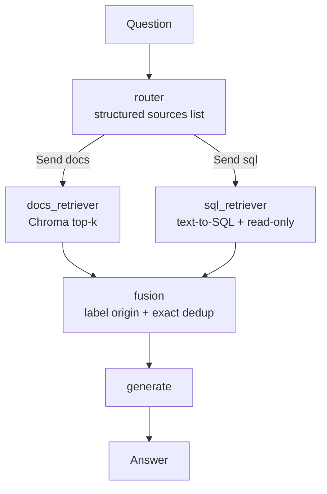

# federated-rag-lab

A teaching ladder from **naive single-source RAG** to **federated multi-source RAG**
orchestrated with LangGraph, ending in a small RAGAS evaluation. Each stage is a
runnable snapshot of the system—not a product, a learning path.

## Who this is for

Engineers who already know how to call an LLM and want a concrete mental model of
**retrieval architecture**: when one vector store is enough, when you need routing,
when you need fan-out across heterogeneous sources, and how to measure the
difference. Code prioritizes readability over cleverness; comments explain *why*.

Domain throughout: a fictional B2B SaaS company, **Meridian Analytics**, with
markdown product docs and a SQLite store of customers / feature flags.

## The ladder

**01 — Naive RAG.** Embed the docs, retrieve top-k chunks, stuff them into one
prompt. Fast to build; blind to structured data. Customer plan and flag questions
correctly degrade to “I do not know.”

**02 — Router.** A LangGraph node picks *exactly one* source (`docs` or `sql`) via
structured output. SQL path drafts a read-only `SELECT` (with value vocabulary so
`sso` is not queried as `SSO`). Multi-source questions still fail or stay partial.

**03 — Federated.** The router may select one or both sources; LangGraph `Send`
fans out in parallel; a fusion node labels origins and dedups; generation uses the
combined bag. This is where “which plan is X on, and what does it include?” becomes
answerable—including pilot flag overrides.

**04 — Eval.** The same 10-question golden set scores stages 01–03 on RAGAS
faithfulness, context precision, and LLM-judged answer correctness. The comparison
table is the punchline of the ladder.

## Architecture (stage 03)



Stages 01 and 02 are simpler slices of this idea (always-docs; single-branch route).

## Quickstart

Requirements: Python 3.12+, [`uv`](https://github.com/astral-sh/uv), an
OpenAI-compatible API key.

```bash
# 1. Install
uv sync

# 2. Configure
cp .env.example .env
# edit .env — set OPENAI_API_KEY; optionally OPENAI_BASE_URL, LLM_MODEL, EMBEDDING_MODEL

# 3. Seed structured knowledge
uv run python scripts/seed_structured.py

# 4. Index docs (shared Chroma store under 01-naive-rag/)
uv run python 01-naive-rag/ingest.py

# 5. Ask through each stage
uv run python 01-naive-rag/ask.py "What does the Professional plan include?"
uv run python 02-router/ask.py "What plan is Orbit Fintech on, and is SSO enabled for them?"
uv run python 03-federated/ask.py "Is Orbit Fintech allowed to use SSO, and why?"

# 6. Evaluate all three pipelines (writes 04-eval/results.md)
uv run python 04-eval/run_eval.py
```

| Path | Purpose |
|---|---|
| `data/docs/` | Sample markdown corpus |
| `data/structured.sqlite` | Created by the seed script (gitignored) |
| `common/` | Shared LLM client, loaders, SQL helpers |
| `01-naive-rag/` … `04-eval/` | Ladder stages with their own READMEs |

## Results

From a real run of `04-eval/run_eval.py` (see [`04-eval/results.md`](04-eval/results.md)):

| Stage | Faithfulness | Context precision | Answer correctness |
|---|---:|---:|---:|
| `01-naive-rag` | 0.550 | 0.522 | 0.250 |
| `02-router` | 0.867 | 0.850 | 0.700 |
| `03-federated` | 0.860 | 0.839 | 0.800 |

Answer correctness by question kind:

| Stage | docs (n=4) | sql (n=3) | both (n=3) |
|---|---:|---:|---:|
| `01-naive-rag` | 0.625 | 0.000 | 0.000 |
| `02-router` | 0.625 | 1.000 | 0.500 |
| `03-federated` | 0.750 | 0.833 | 0.833 |

Reading the table: stage 01 collapses on anything that needs SQLite; stage 02
fixes pure SQL items; stage 03 leads on **both** (multi-source) questions—the
point of federation. Faithfulness can be high even when the answer is incomplete
if the model stays inside a too-narrow context bag.

## What production adds

This lab intentionally omits:

- Cross-source **reranking** and token-budget packing
- Per-source **timeouts**, retries, and partial-failure answers
- AuthZ on structured sources and row-level security
- CI golden **regression gates**, dataset ownership, and metric drift monitors
- Empty-SQL **self-repair**, human review queues, and citation UX
- Streaming, UI, deployment, and multi-tenant isolation

Use the ladder to understand the seams; ship the seams with the operational
layer your reliability and compliance requirements demand.

## License

MIT — see [LICENSE](LICENSE).
